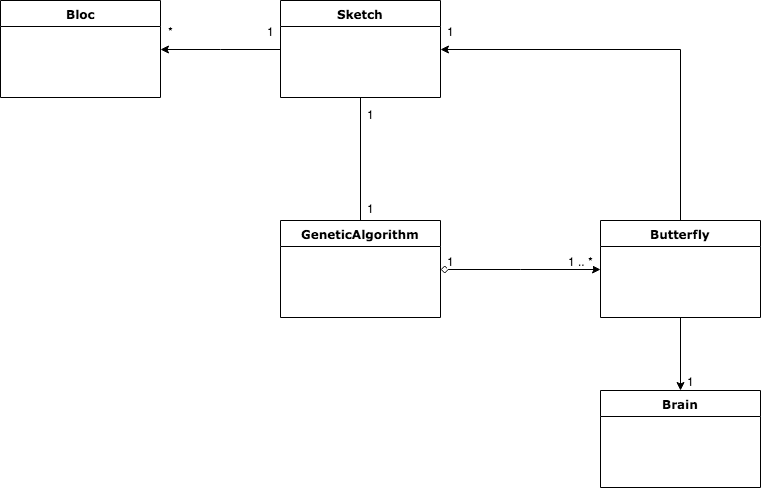
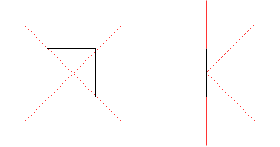
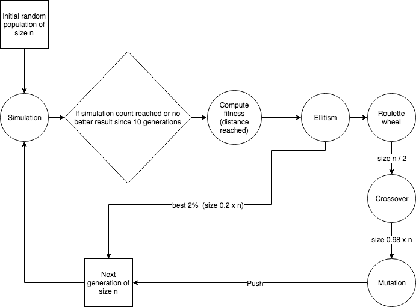

# FlyIA !

FlyIA is a butterflies simulator based on **artificial intelligence** and **genetic algorithms**.
Severals blocs with different size and position are randomly instanced to create an environment in which butterflies will evolve.

# How it works
## Simulation

Click on the **Start Simulation** button. You may create a simulation by indicating the number of generation you want for the genetic algorithm and the number of butterflies per generation. The simulation will stop in two cases:
* The number of generation is reach by the simulation
* There is no better fitness results since 10 generations

At the end of the simulation, neural network's weights of the best butterfly are downloaded. You may load them to start a modelisation which is a simulation with one butterfly.

## Modelisation
Click on the **Load weights** button. The modelisation can be accessible after a simulation. It's a way to see your best butterfly evolve in the environment.

# Butterfly and interactions with environment
A butterfly have to interact with the environment to compute distances between it and blocs. To do this, each butterfly have 17 "eyes" which are raycasts starting from the center of the butterfly and a direction. Directions are:
* Whithout inclination:
    * Left
    * Up left
    * Up
    * Up right
    * Right
    * Down right
    * Down
    * Down left
* With a 45 degree inclination: 
    * Left
    * Up left
    * Up
    * Up right
    * Right
    * Down right
    * Down
    * Down left
* Front

Those directions are describe on the picture below.

# Genetic algorithm

The genetic algorithm works in several steps:
* The creation of a random first generation.
* The computing of the fitness value after a simulation (in this case the fitness value if the distance reached by butterflies).
* The ellitism: selection of the best 2% of the last generation
* The roulette wheel : To randomly select 50% of the butterflies.
* Crossover : To generate 2 childs from 2 randomly selected parents until we haven't reach the initial size of the population.
* The mutation: A random modification in our butterflies weights to keep the diversity and avoid local minimums by preventing the population from becoming too similar to each other.

# Neural network

Neural networks used in this project are **multilayer perceptron**. The first layer takes 17 inputs nodes which are the distance computed by the butterfly he is related to. Then comes an hidden layer with 15 nodes and finally there is 2 output nodes, one for the left/right direction and the other for up/down direction. All activation function which are used for the hidden and the output are sigmoid. For the left/right output node, if the value of the output is < 0.5, then the butterfly goes left, otherwise, it goes right. The same thing for the up/down output, if <0.5 the butterfly goes down, otherwise it goes up.
